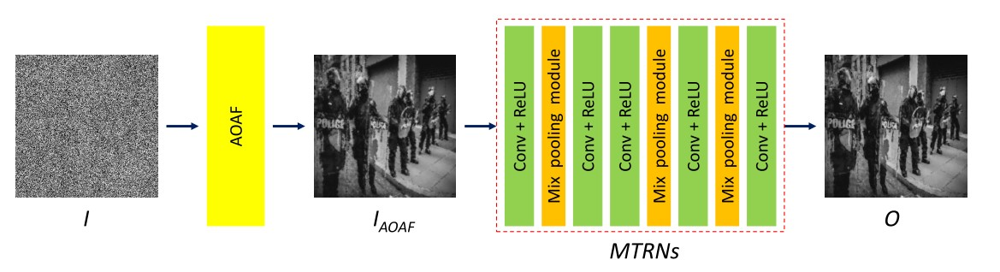
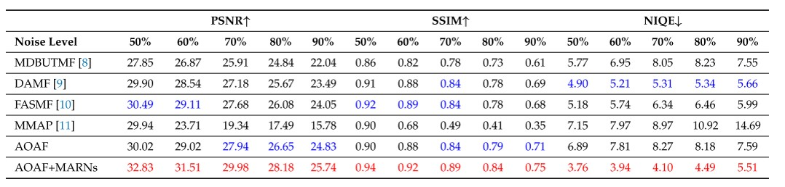
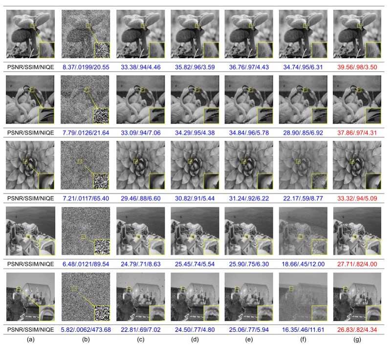

# AOAF-MARNs-paper
Image Denoising Using Adaptive and Overlapped Average Filtering and Mixed-Pooling Attention Refinement Networks paper

[](https://www.mdpi.com/2227-7390/9/10/1130)

## Network Architecture



## Environment
- Windows 10 
- GeForce RTX 3090 GPU
- python3.8.6
- torch=1.8.1
- torchvision=0.9.1

## Installation

1. Install virtual environment:
	```shell
	virtualenv -p python3 exp2 # establish
	.\exp2\Scripts\activate # activate 
	```

2. Clone this repo:
	```shell
	git clone https://github.com/josephhou626/AOAF-MARNs-paper.git # clone
	```

3. Install torch and torchvision:
	```shell
	pip3 install torch==1.8.1+cu111 torchvision==0.9.1+cu111 torchaudio===0.8.1 -f https://download.pytorch.org/whl/torch_stable.html
	```

4. Install dependencies:
   ```shell
   cd main_scene_dection
   pip install -r requirements.txt
   ```


## Dataset


## Train


## Test


## Results
**Quantitative Evaluations**


**Qualitative Evaluations**


## Evaluation


## Reference

- "[SPNet](https://github.com/Andrew-Qibin/SPNet)"

